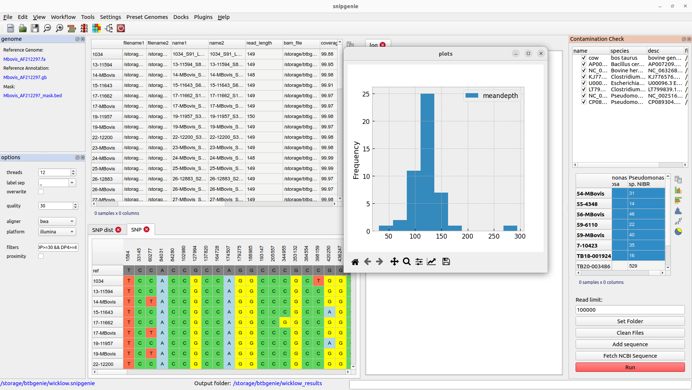
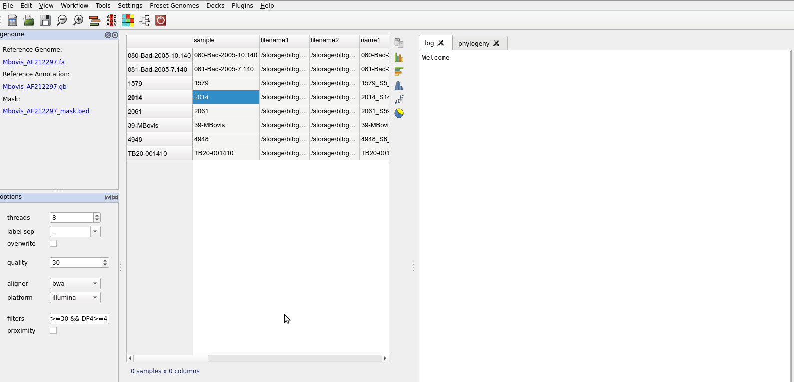
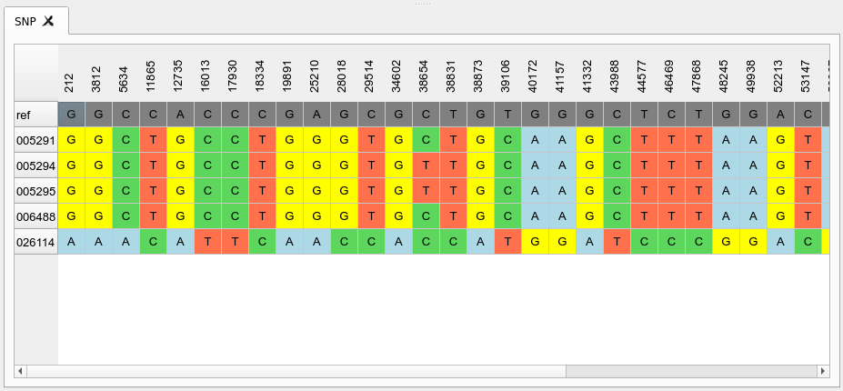
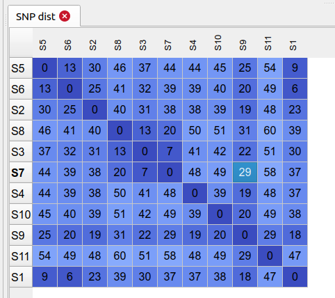
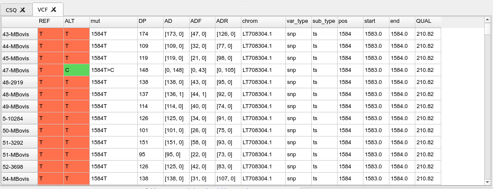
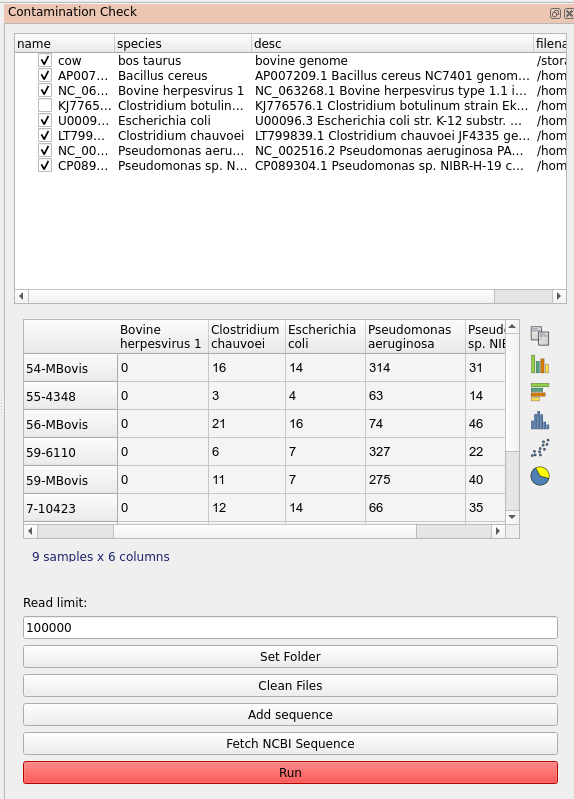

Desktop Application
===================

The graphical user interface is designed for those not comfortable with the command line
and includes some additional features. It requires the installation of either PyQt5 or PySide2
if using the pip install. A windows installer for this application will be available separately.

Current features include:

* Simple fastq quality analysis
* View read alignments
* Phylogenetic tree viewing
* Contamination checker

Interface
---------

Basic workflow
--------------

* The first step is to set an output folder for the results. Choose *Settings->Set Output Folder*. Note that if this folder already contains a set of results from a previous run of the command line tool the program will attempt to load the sample table.
* Set a reference genome either by using a preset species or loading a fasta sequence you have previously identified as the one you wish to use. To load a preset use the Preset Genomes menu. The reference should currently be a single chromosome. Preset genomes have an annotation (genbank format) and sometimes a mask file (bed format) associated with them. However you can run without these.
* Save the project somewhere. It will be saved a single file with a .snipgenie extension. This only saves the loaded tables and settings and not the output results.
* Load the fastq files you wish to analyse. These can be selected individually or and entire folder added. Use *File-> Add Folder* or *File->Add Fastq Files*. When the files are loaded the samples table will be updated to reflect the files and their assigned labels. See importing files.
* Once files are loaded you can being analysis. Prior to alignment you may want to check your files for contamination, though this can be done at a later stage to exclude samples causing problems (e.g. samples that have poor depth).
* The first step is align the fastq files. This is accessed from the Workflow menu. You should select the files in the table to be aligned. Just select all rows to align everything.
* After alignment you will see the table updated

   Basic workflow steps.

Importing files
---------------

Viewing results
---------------

SNP table
+++++++++

This is a view of the SNPs in a table for all samples and each position. This is loaded from the core.txt file in results that is the product of filtered SNPs. This is what is used to make the final phylogeny. Below is shown the table with positions in the columns and each row is a sample. You can transpose or flip the table too.

SNP distance table
++++++++++++++++++

This shows the distance matrix of samples derived from the core SNP alignment above. The samples can be sorted by their order in the phylogeny stored in the project.

VCF table
+++++++++

This lets you view the content of vcf files that are the product of variant calls. Normally useful for debugging errors that might be occurring or checking on the depth and quality values for a position/site. By default the filtered SNPs vcf will be displayed but you can load other vcf/bcf files from the file system.

CSQ table
+++++++++

This is a table showing the contents of the csq.tsv file that is calculated as from the *consequence calling* step. This is only present if we have provided a genbank annotation file when running the variant calling. This shows the effects of each identified SNP in terms of their amino acid changes in the annotated proteins along the genome.

Plotting from the tables
------------------------

Some tables will allow you to make simple plots from numerical data.

Adding sample metadata
----------------------

Checking for contamination
--------------------------

The program includes a plugin tool called Contamination Check for this purpose. It allows you to check for the presence of possible contaminants by aligning a subset of the reads against arbitrary genomes that you can select. A number of bacterial genomes are provided by default but you will often want to customise this. There are two ways to add a sequence:

  * Find the sequence you want, download it and add from the local file system using the 'Add Sequence' button.
  * You can download directly from NCBI using an accession number. To make it easier to find the sequence you want there is a link to the nucleotide search page accessible via the help menu. This will open the page inside the application in a browser tab.

When you add references the top list will be updated, you can deselect if you don't want to include them in the search. By default the output is written to the 'contam' folder in your results folder. Use *Clean Files* to remove the temporary bam files if they are taking too much space. Once you have the references to check against, select the samples in the main table you want to check and click run in the plugin dialog.

Results are displayed as a separate table in the plugin dialog. This will show the number of reads mapped to each reference. This gives a rough idea of the composition of our sample and whether it contains what we expect.

Create test data
----------------

This plugin allows you to simulate a set of read data based on a pre-defined phylogeny and reference genome. The purpose of this is to test the workflow against known data. It also provides a useful dataset to practice with.

File renaming
-------------

Batch file renaming
