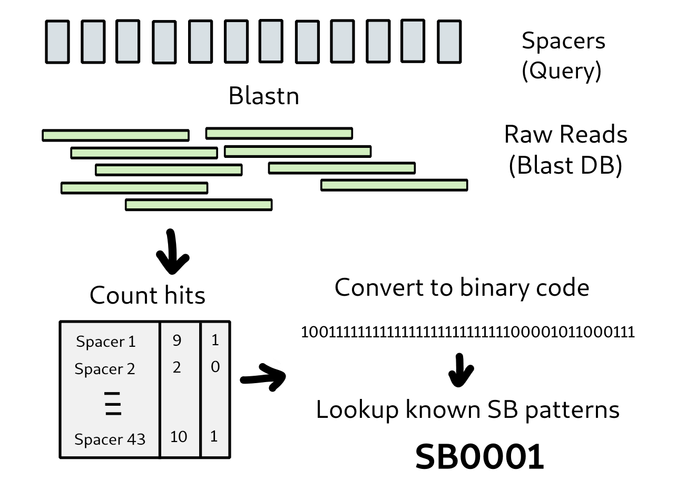

*M.bovis* analysis
================

This tool was initially written for analysis of M.bovis isolates. It can however be used for any other bacterial or viral species for which this kind of workflow is appropriate.
The tools documented here are specific to M.bovis.

Spoligotyping
-------------

Spoligotyping (spacer oligonucleotide typing) is a widely used genotyping method for M. tb (Mycobacterium tuberculosis species), which exploits the genetic diversity in the direct repeat (DR) locus in Mtb genome. Each DR region consists of several copies of the 36 bp DR sequence, which are interspersed with 34 bp to 41 bp non-repetitive spacers. A set of 43 unique spacer sequences is used to classify Mtb strains based on their presence or absence. This a molecular method traditionally conducted using a PCR-based or other method. Whole genome sequence is a far more sensitive method of phylogenetic identification of strains and makes other typing methods redundant if you have the whole sequence. It may be useful however to relate the sequence back to the spoligotype in some circumstances. It is not hard to calculate the spoligotype by analysis of the raw sequence reads (or an assembly).

`About the method <http://dmnfarrell.github.io/bioinformatics/spoligotyping-wgs>`_

Regions of difference
---------------------
