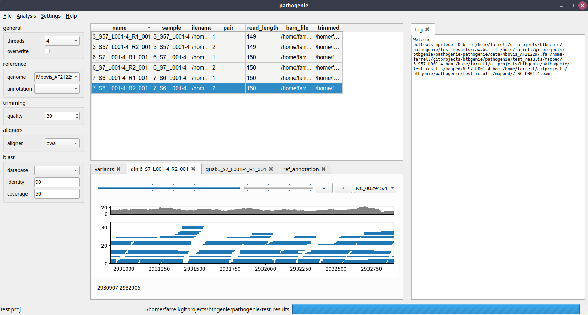

Introduction
============

**Pathogenie** is a desktop application for microbial variant calling and phylogenetic analysis from raw read data. It is primarily written to be used with bacterial isolates of MBovis but can be applied to other species. This is in early stages of development. Anyone interested in using the software is encouraged to make sugggestions on improving or adding features.

This software is written in Python and is developed with the Qt toolkit using PySide2. It was made on Ubuntu linux but is designed to also run on Windows 10 with a standalone application.

The Desktop application
=======================

Unlike many other SNP calling pipelines, this tool is designed around a graphical user interface. Though it will also work from the command line and via Python scripts.

Current Features
================

* load multiple fastq files and process together
* view fastq quality statistics
* trim reads
* align to reference
* view bam alignments
* call variants
* filter variants
* create SNP core multiple sequence alignment
* create phylogenetic tree

Links
=====

http://dmnfarrell.github.io/btbgenie

Installation
============

Linux
-----

Install dependencies::

  pip install pandas matplotlib biopython pyside2
  sudo apt install bcftools samtools bwa

Get the current version from github::

  git clone https://github.com/dmnfarrell/btbgenie.git

Windows
-------

A standalone installer will be used to deploy on windows.

Mac OSX
-------

Use the Linux instructions.
